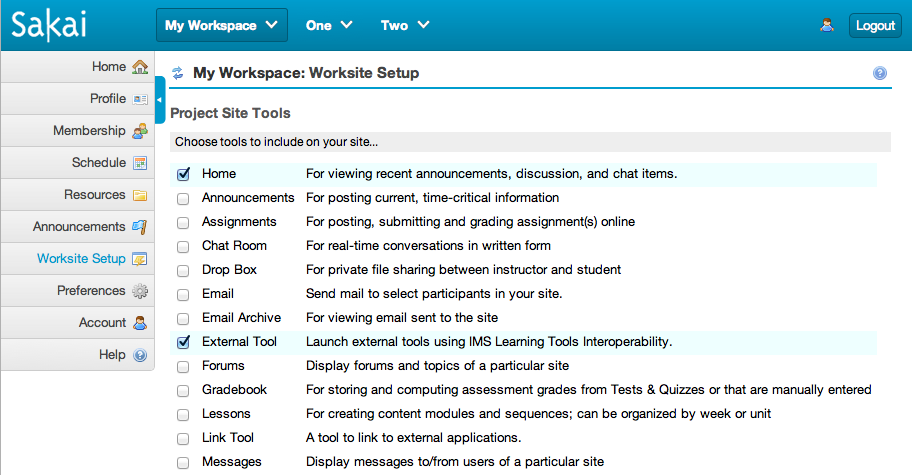
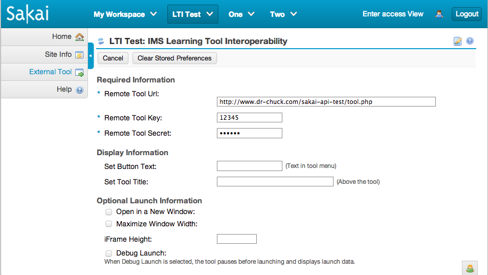
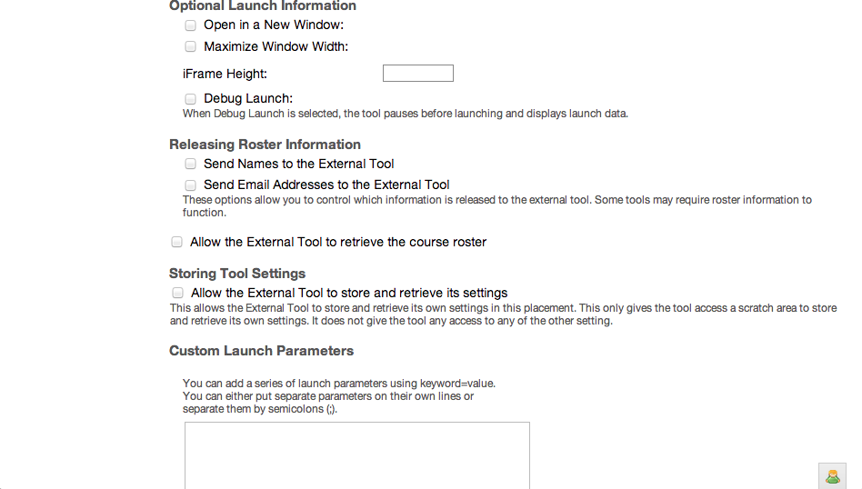
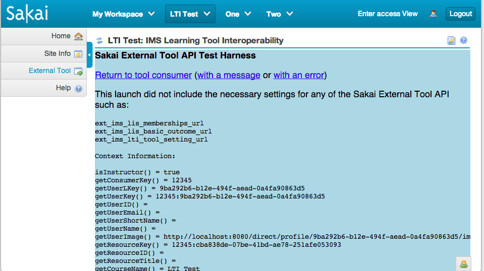
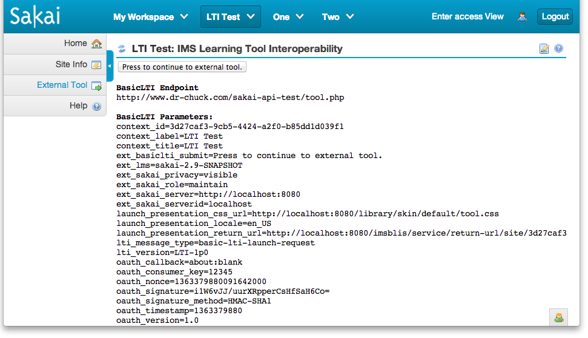
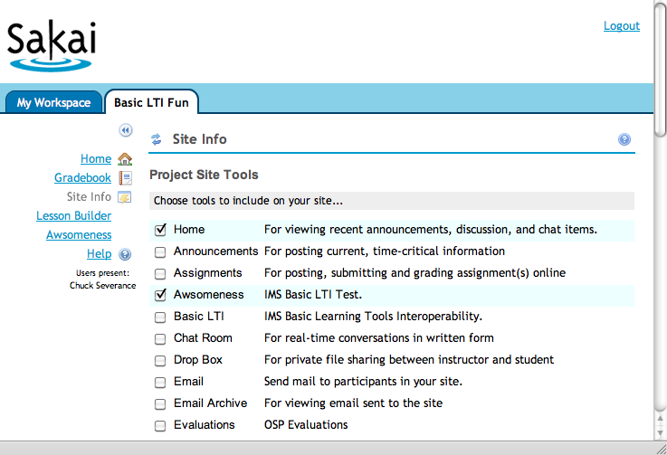
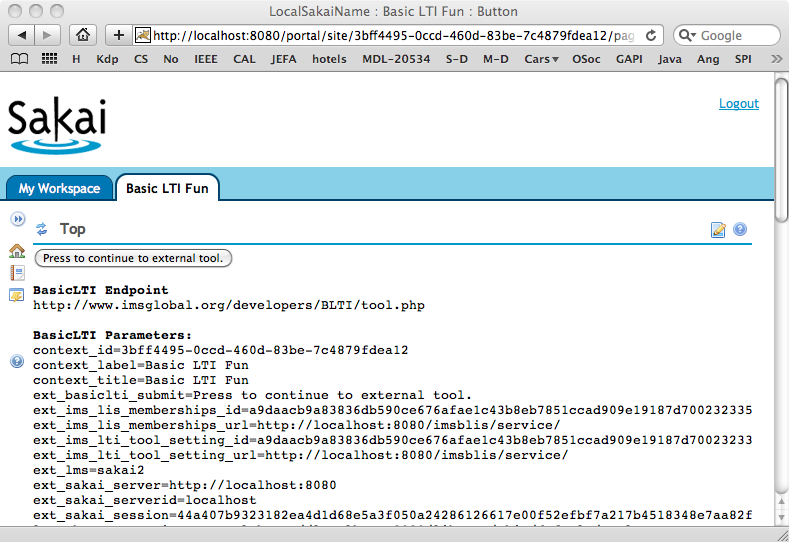
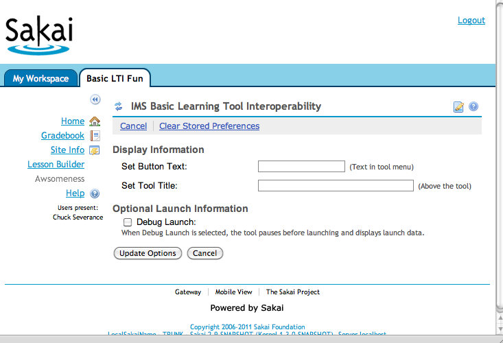

Using the Sakai External Tool Portlet
=====================================

Charles Severance

January 29, 2014

Introduction
============

The Sakai External Tool (IMS Learning Tools Interoperability) portlet
implements the IMS Basic Learning Tools Interoperability standard. LTI
allows the launching and sharing of information with an externally
hosted tool using standard protocols, signed securely using the OAuth
(www.oauth.net) security mechanism.

The Sakai External Tool portlet supports three basic use cases:

-   An instructor can crate a tool placement which points to an external
    tool and put in a URL, secret, and password to "mash-up"
    functionality from various sources into their course.

-   The system administrator can create virtual tool pointing to an
    externally hosted tool and place the tool into Site Setup.
    Instructors can add the tool to their site without even knowing that
    the tool is hosted externally and it will be launched using LTI.

-   The system administrator makes a site-licensing arrangement with an
    external provide of software as a service (such as Icodeon) or
    protected content from a publisher (such as Pearson or McGraw-Hill)
    and allow instructors to point to the resources without needing
    a password.

The basic idea is that the External Tools portlet provides an endpoint
for an externally hosted tool or content and makes it appear if the
externally hosted tool is running within Sakai. In a sense this is kind
of like a smart “iFrame” tool that can host lots of different content.

The External Tools portlet provides the externally hosted tool/content
with information about the individual, course, tool placement, and role
within the course and allows a “federated single-sign-on” using
in-browser REST-style launching and allows an externally hosted tool to
support many different LMS’s from multiple vendors with a single
instance of the external tool or resource.

Basic Mash-Up
=============

The External Tool portlet can be added to the site multiple times from
Site Info or the site creation workflow:

Once the tool is placed in the site, it must be configured. Pressing the
"pencil" icon in the title bar configures JSR-168 portlets. The
configuration screen of the Basic LTI tool is as follows:

The External tool provider will give the instructor a launch url, key
and secret. In addition to providing these fields, the instructor can
set the button text, title text, and iframe height to control how the
tool is displayed in Sakai.

The "debug launch" feature causes Sakai to pause before submitting the
single sign on data to the external tool. In a debug launch the user is
presented a button to submit the launch data to the external tool. He
debug launch is described in more detail below.

The next set of configuration fields deal with the release of student
names and E-Mail addresses and allows the instructor to set any needed
custom parameters.

The custom parameters are fields are defined by the tool and may be
required by the external tool.

Once the tool configuration is completed, the tool is immediately
launched.

Site-Wide Passwords / Site-Licensed Content
===========================================

Sometimes a vendor will want to give a site-wide license to some content
to an LMS. The vendor will want to give a single secret and password
that is to be used to sign all of the requests coming from that LMS
system.

Having a site-wide secret/password gives a lot of benefit to the
external tool/content providers:

-   It eliminates managing lots of passwords and talking to lots of
    instructors and resetting lots of lost passwords..

-   It allows the external tool to assume that launches with the same
    **user\_id** from course to course represents the same user and that
    when the tool sees the same **course\_id** across multiple launches,
    it is truly the same course, regardless of the password/secret in
    the possession of the instructor. This allows the external tool to
    look at its data for a user across courses within an institution.

-   It allows them to distribute "generic" urls that do not encode a
    "course id" in the URL such as
    **http://katana.mhhe.com/psycology/chapter04/** where the URL
    indicates a resource – but does not include "context" the user is
    coming from.

These site-wide passwords are set based on a site-wide identifier chosen
by the LMS admin and used across tool vendors. This is set in
**sakai.properties** as follows:

    basiclti.consumer_instance_guid=newclasses.nyu.edu
    basiclti.consumer_instance_name=NYU Classes
    basiclti.consumer_instance_description=Longer text
    basiclti.consumer_instance_contact_email=classes-support@nyu.edu
    basiclti.consumer_instance_url=http://newclasses.nyu.edu

You can set LMS\_wide key/password combinations using the following
properties. The LMS-wide properties use the hostname in the launch URL
to look up the key and secret. The LMS-wide key and secret take
precedence over the resource-level key and secret. If the
**consumer\_instance\_guid** is specified, it is the default for a
launch domain if the key is not specified.

    basiclti.consumer_instance_secret.mhhe.com=98765

	basiclti.consumer_instance_key.math.pearson.com=nyu.edu
	basiclti.consumer_instance_secret.math.pearson.com=d1c2e3

	basiclti.consumer_instance_key.tsugi.org=12345
	basiclti.consumer_instance_secret.tsugi.org=secret

Where **math.pearson.com**, **mhhe.edu,** and **www.tsugi.org** are
pulled from the hostname in the launch url to select the correct secret
for the particular launch. In this example **katana.mhhe.com** in a
launch url would match **mhhe.com**.

When a site wide key/password combination exists for a launch, it is
always used (i.e. any instructor-entered key/secret information is
ignored). This also means that tools can be placed with no key/secret
information at all. It also means that any authoring UI needs to have
the key and secret be optional.

These secrets should be protected (like database connection passwords)
so care should be taken when storing this information in source control
or passing files around. Also the secrets should be long and random and
changed from time to time.

The OAuth security mechanism is vulnerable to robot-guessing of the
password. So having long passwords and varying the length and content
makes robot guessing far less tractable.

Test Sites
==========

I have several test sites that you can use that I will try to keep up as
much as possible:

**https://www.tsugi.org/lti-test/tool.php**

This site accepts any key with a secret of "secret". This site also
includes a test LMS so you can test your own external tools with a known
LMS implementation.

The test code is also available for your use at:

**https://github.com/tsugiproject/lti-test**

You can run a local copy on your workstation or your own server.

Launching with Debug Mode
=========================

If you select Debug Mode the tool launch is paused "half-way-through"
and the user is presented a button to continue. This is most useful to
debug problems with an external tool. You can view the source of the
iframe or simply look at the parameters on the screen.

When you press the button, the launch continues to the external tool.
While it might seem strange to see the launch data, the OAuth approach
(www.oauth.net) to security is designed assuming that the launch data
may be viewed as it passes through the browser in a form post.

LMS Feature - Virtual Tool
==========================

In this scenario, the Sakai administrator is going to create a virtual
tool and set some or all of the parameters for the tool. The Instructor
will see the virtual tool as any other tool in Site Setup and the
students will see and use the tool like any other tool with no indicator
that the tool is running outside Sakai.

We create a virtual tool by editing the tool registration file -
IMSBLTIPortlet.xml – this file contains the registration for the
External Tool as follows:

    <?xml version="1.0"?>
    <registration>
        <tool
                        id="sakai.basiclti"
                        title="Basic LTI"
                        description="IMS Basic Learning Tools Interoperability.">

                <configuration name="sakai:portlet-pre-render" value="true" />

                <category name="course" />
                <category name="project" />
                <category name="portfolio" />

                <!-- Allow this to be set -->
                <configuration name="functions.require" />

                <!-- The default / pre-configured settings for this
                     placement.  If you set a value here and don't make
                     it final below - it is just the default and the
                     Instructor can edit it.   If you make it final
                     the Instructor won't even see the value.  

                     If you make everything final, then the Instructor's
                     tool configuration screen will be empty.

                     Adminitrators can set any of these Parameters in the
                     Sites tool and set the finalness of the parameters
                     as well.  -->
                <configuration name="imsti.launch" />
                <configuration name="imsti.xml" />
                <configuration name="imsti.secret" />
                <configuration name="imsti.key" />
                <configuration name="imsti.pagetitle" />
                <configuration name="imsti.tooltitle" />
                <configuration name="imsti.newpage" />  <!-- on/off -->
                <configuration name="imsti.maximize" /> <!-- on/off -->
                <configuration name="imsti.frameheight" />
                <configuration name="imsti.debug" />  <!-- true/false -->
                <configuration name="imsti.releasename" />  <!-- on/off -->
                <configuration name="imsti.releaseemail" />  <!-- on/off -->
                <configuration name="imsti.custom" />
                <configuration name="imsti.allowsettings" /> <!-- on/off -->
                <configuration name="imsti.allowroster" />  <!-- on/off -->
                <configuration name="imsti.allowoutcomes" /> <!-- on/off -->
                <configuration name="imsti.contentlink" />
                <configuration name="imsti.splash" />

                <!-- Setting these to true means the corresponding above values
                     cannot be altered by the instructor.  -->
                <configuration name="final.launch" value="false"/>
                <!-- We default xml to final to suppress it in the display -->
                <configuration name="final.xml" value="true"/>
                <configuration name="final.secret" value="false"/>
                <configuration name="final.key" value="false"/>
                <configuration name="final.pagetitle" value="false"/>
                <configuration name="final.tooltitle" value="false"/>
                <configuration name="final.newpage" value="false"/>
                <configuration name="final.maximize" value="false"/>
                <configuration name="final.frameheight" value="false"/>
                <configuration name="final.debug" value="false"/>
                <configuration name="final.releasename" value="false"/>
                <configuration name="final.releaseemail" value="false"/>
                <configuration name="final.custom" value="false"/>
                <configuration name="final.allowsettings" value="false"/>
                <configuration name="final.allowroster" value="false"/>
                <configuration name="final.allowoutcomes" value="false"/>
                <configuration name="final.contentlink" value="false"/>
                <configuration name="final.splash" value="false"/>

                <!-- Allow multiple instances of this tool within one site -->
                <configuration name="allowMultipleInstances" value="true" />
            </tool>
    </registration>

The administrator can add multiple tool registrations to this file by
adding multiple &lt;tool&gt; sections. The External Tool portlet has
several capabilities controlled by properties. The basic idea is that
you can set a property that is equivalent to setting the property in the
configuration screen of the tool. And if you also set the corresponding
"final" property to "true" – then the instructor will neither see, nor
be able to change that property. So the administrator can set and
completely lock down the properties – or lock-down most of the
properties.

The configuration screen only displays the "non-final" properties. Here
is a simple example additional registration:

<tool
                        id="sakai.imstestlti"
                        title="Awesomeness"
                        description="IMS Basic LTI Test.">

                <configuration name="sakai:portlet-pre-render" value="true" />

                <category name="course" />
                <category name="project" />
		 <category name="portfolio" />

                <configuration name="functions.require" />

                <configuration name="imsti.launch"
                   value="https://www.tsugi.org/lti-test/tool.php" />
                <configuration name="imsti.xml" />
                <configuration name="imsti.secret" value="secret" />
                <configuration name="imsti.key" value="12345" />

                <configuration name="imsti.pagetitle" />
                <configuration name="imsti.tooltitle" />
                <configuration name="imsti.newpage" value="off" />
                <configuration name="imsti.maximize" value="on" />
                <configuration name="imsti.frameheight" />
                <configuration name="imsti.debug" />
                <configuration name="imsti.releasename" value="off"/>  
                <configuration name="imsti.releaseemail" value="on"/>
                <configuration name="imsti.custom" />
                <configuration name="imsti.allowsettings" value="on"/>
                <configuration name="imsti.allowroster" value="on"/>
                <configuration name="imsti.allowroutcomes" value="on"/>
                <configuration name="imsti.contentlink" />
                <configuration name="imsti.splash" value="You are about to visit Dr. Chuck..."/>

                <configuration name="final.launch" value="true"/>
                <configuration name="final.xml" value="true"/>
                <configuration name="final.secret" value="true"/>
                <configuration name="final.key" value="true"/>

                <configuration name="final.pagetitle" value="false"/>
                <configuration name="final.tooltitle" value="false"/>
                <configuration name="final.newpage" value="true"/>
                <configuration name="final.maximize" value="true"/>
                <configuration name="final.frameheight" value="false"/>
                <configuration name="final.debug" value="false"/>
                <configuration name="final.releasename" value="true"/>
                <configuration name="final.releaseemail" value="true"/>
                <configuration name="final.custom" value="false"/>
                <configuration name="final.allowsettings" value="true"/>
                <configuration name="final.allowroster" value="true"/>
                <configuration name="final.allowoutcomes" value="true"/>
                <configuration name="final.contentlink" value="false"/>
                <configuration name="final.splash" value="true"/>
        </tool>

Note that it is important to give the new tool registration a new tool
identifier (i.e. **sakai.testlti**).

In some situations where you are installing a vendor tool, they may ask
you to specify every single parameter and then set them all to final.

Note: **xml** is effectively deprecated – it is still in the code – but
no longer shows up in the configuration UI.

Also note that the **xml** and **launch** parameters are related when it
comes to making them final. If **xml**, **secret**, and **key** are
final, then **launch** will not be editable in the portlet and similarly
if **launch**, **secret**, and **key** are final, then **xml** will not
be editable in the portlet.

Also note that **launch** has precedence over **xml**. If both are
specified - **launch** will be used.

Another way to set properties for a portlet is to use the
**sakai.properties** file. When you set a property in this way it acts
as final and overrides values in the tool registration, above and
suppresses the ability to edit the field in the Portlet.

    sakai.testlti.launch=https://www.tsugi.org/lti-test/tool.php
    sakai.testlti.key=12345
    sakai.testlti.secret=secret

It is a good idea when using this feature to set all of the
configuration in the tool registration XML including which fields are
final, except perhaps the **launch**, **key** and **secret** and then
specify **launch**, **key** and **secret** in the **sakai.properties**
file. This allows you to change a **key** and **secret** without
touching the XML registration file.

There are three parameters that control the "splash" screen that is
displayed before the user is sent to the external site.

-   **overridesplash** is only settable by the administrator and
    allows HTML. If this property is present – all other splash
    properties are ignored on a placement.

-   **splash** is a normal property that can be set in the user
    interface – this property does not allow HTML (i.e. it is escaped)
    before display

-   **defaultsplash** is a property that is set by the administrator
    only and allows HTML. This property is only used if none of the
    other two properties are present for the placement.

In general when Sakai is trying to resolve a property, it first looks at
the **sakai.properties** file, then looks at the tool placement and
depending on the finalness of a property, either looks at the tool
registration value for the property or the user-entered value for the
property.

So if you wanted to force a splash screen for all **sakai.basiclti**
tool placements ignoring any user-entered splash, adding the following
to your **sakai.properties** would accomplish that:

sakai.basiclti.overridesplash=&lt;b&gt;You are leaving Sakai to visit an
external site. Best of Luck.&lt;/b&gt;

You could also set a default that would be used if there were no other
splash defined. You can use a combination of **sakai.properties**, the
tool registration, and administrator Site Editing screen to achieve lots
of combinations of splash screen options. It is a little intricate to
allow administrators to use HTML and filter input from instructors in
the configuration screen.

When this tool registration is added, it appears in the tool list as any
other tool:

Once the tool is selected, since the launch is pre-configured – the user
(Instructor or student) simply sees the tool output:

If the instructor goes into the configuration screen, those properties
marked "final" are not shown and cannot be edited.

This provides a lot of flexibility in allowing the instructor to set
**some** of the fields as determined by the LMS administrator.

The additional tool registrations can be placed in the
**IMSBLTIPortlet.xml** file in the BasicLTI source tree or they can be
placed in the **sakai.home** directory within your tomcat as follows:

\${sakai.home}/portlets/imsblti/IMSBLTIPortlet.xml

\${sakai.home}/portlets/IMSBLTIPortlet.xml

The path that includes the servlet name (**imsblti**) is the preferred
location for the files. The name of the XML file must match the
portlet's name as defined in the **portlet.xml** file. When either of
these files is present, the I**MSBLTIPortlet.xml** file from the war is
ignored.

**Important Note:** When you create either of these files in
**sakai.home**, Sakai's portlet tool registration will ignore the tool
registration of **sakai.basiclti** from within the war file. So you must
include the registration of **sakai.basiclti** in the file that you
store in **sakai.home**. This does give you the option of choosing to
not registe the "generic tool" and only registering the virtual tools
that you choose. It also allows you to change the defaults of the
generic **sakai.basiclti** tool as well based perhaps on your site's
policies by creating this file in **sakai.home**.

This allows administrators to deploy new tools and change configuration
options without making a patch or recompiling Sakai.

Administrators can also create "one-off" custom tools for a site by
placing the generic External Tool into a site and going into the
administrator screen and altering the properties for the tool placement.
The admin can set all properties and mark them as final as needed. This
can be used to whip up a "virtual tool" without restarting Sakai or to
test tool settings before making a new permanent tool registration.

Architecture and Hacking
========================

The Basic LTI approach is quite simple – to launch the tool, the LMS
creates a form with the LMS data, uses OAuth to sign the form data and
posting URL, and the OAuth parameters are added to the form. The form is
then sent to the browser and looks as follows:

    

    <form action="http://wiscrowd.appspot.com/wiscrowd/12345/" name="ltiLaunchForm" id="ltiLaunchForm" method="post">
    <input type="hidden" size="40" name="user_id" alue="6d1d2d08-8ba6-438c-ab60-4a795acd67bb"/>
    <input type="hidden" size="40" name="lis_person_name_full" value="csev"/>
    <input type="hidden" size="40" name="context_id" value="63ed6677-6ac4-4a38-b89f-466f7f51fc68"/>
    <input type="hidden" size="40" name="lis_person_sourced_id" value="csev"/>
    <input type="hidden" size="40" name="context_title" value="LTI Test"/>
    <input type="hidden" size="40" name="oauth_signature" value="ORm1rXpJUOQj8nl1Haqzxg9Y138&#61;"/>
    <input type="hidden" size="40" name="ext_sakai_server" value="http://localhost:8080"/>
    <input type="hidden" size="40" name="oauth_nonce" value="1248267304363525000"/>
    <input type="hidden" size="40" name="resource_link_id" value="1df05052-51e6-4d52-a118-997f62229000"/>
    <input type="hidden" size="40" name="roles" value="Instructor"/>
    <input type="hidden" size="40" name="ext_sakai_serverid" value="charles-severances-macbook.local"/>
    <input type="hidden" size="40" name="oauth_signature_method" value="HMAC-SHA1"/>
    <input type="hidden" size="40" name="oauth_callback" value="about:blank"/>
    <input type="submit" size="40" name="basiclti_submit" value="Launch Endpoint with BasicLTI Data"/>
    <input type="hidden" size="40" name="oauth_timestamp" value="1248267304"/>
    <input type="hidden" size="40" name="lti_version" value="basiclti-1.0"/>
    <input type="hidden" size="40" name="oauth_version" value="1.0"/>
    <input type="hidden" size="40" name="launch_presentaion_locale" value="en_US"/>
    <input type="hidden" size="40" name="oauth_consumer_key" value="12345"/>
    </form>
    
 

The form contains both the LMS data and the OAuth security material
including the **oauth\_signature**. The portlet also includes JavaScript
to hide the form, and then automatically submit the form. If JavaScript
is turned off, the form submit button remains visible and the user must
press the button to proceed to the external tool.

Since External Tool is a portlet, we do not have the
"frame-within-frame" problem that Linktool would have since LinkTool is
a traditional Sakai tool. But since Basic LTI demands an iframe for an
external tool the External Tool portlet generates an iframe for the
external tool content and places the following URL into the iframe:

/access/basiclti/site/63ed6677-6ac4-4-466f7f51fc68/dcb61c3e-508-3238ecd330cc

The URL is served through /access and a **basiclti** Entity Producer.
This means that the URL can effectively be used anywhere. It needs to be
in its own window or in an iFrame because it will generate and
auto-submit the form data as shown above – but this allows clever reuse
of these placement urls.

An instructor could author some placements – then hide the buttons using
Page Order tool and then simply use these URLs wherever appropriate. Of
course users must belong to the site and be logged in for the external
resource to launch.

In fact, if there was interest, we could write web services or a Site
Info extension to make placements independent of the tool and then
simply launch to the proper URL. Another possible feature would be to
add a checkbox to "hide the tool from students" and show the instructor
the access URL as part of the configuration dialog.

Comparing Basic LTI With Sakai LinkTool
=======================================

Within the Sakai community, one of my goals is to convince developers to
stop using the LinkTool since the LinkTool only works with Sakai.
Developers who have built external tools that support the LinkTool
protocol should be able to add Basic Tool Interoperability.

Since IMS LTI 1.1 uses OAuth, it does not require any web-services
call-back to Sakai for key validation (i.e. you do not need to call
SakaiSigning.jws). This allows as Sakai site to use IMS LTI 1.1 with
web-services turned off and also improves reliability in situations
where campus proxy servers are in operation that may block some of these
web service calls. Also it discourages the writing of tools that "trust"
the linktool call parameters without calling Sakaisigning.jws.

The ultimate advantage of using IMS LTI 1.1 over LinkTool is primarily
the fact that as more consumer/proxy tools are written in different
environments such as Blackboard, Desire2Learn, OLAT, WebCT, Moodle,
ATutor, Canvas, etc – that these tools can work in those environments as
well as Sakai.

IMS LTI 1.1 does put a small additional burden on external tool
developers, as they need to support the OAuth approach and IMS LTI 1.1
sign-on (see sample code from IMS).

It is possible for an external tool that uses IMS LTI 1.1 for launch,
provisioning, and trust to use the run-time web services developed for
use with LinkTool tools. If the property **ext\_sakai\_session** is set
to "true" in the tool placement, the Sakai BasicLTI tool includes a
signed session key and server information in the **ext\_sakai\_session**
and **ext\_sakai\_server** variables. These values are created in the
exact same manner as the LinkTool so they can be used with these web
services. As of LTI 2.1.0 and Sakai 2.9.2 these values are not send by
default as they potentially a security exploit for an unscrupulous tool.
