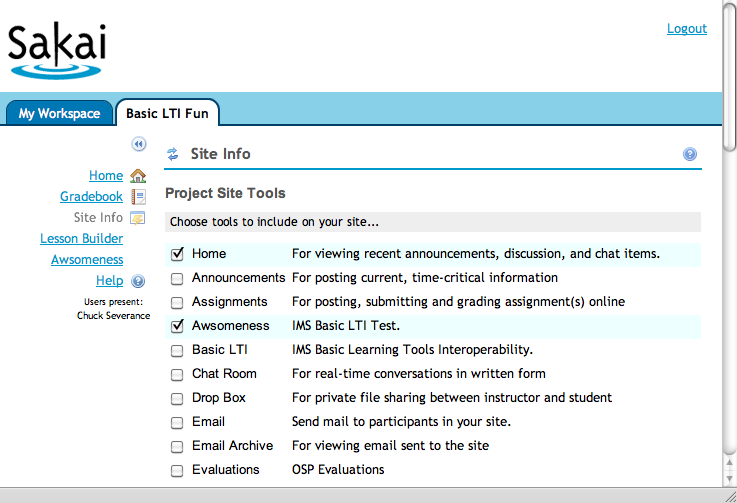
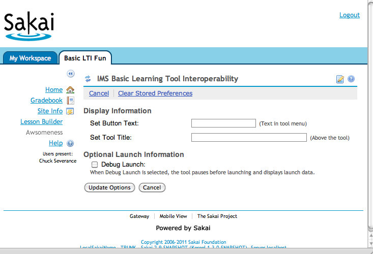

Pre-Installing the IMS BasicLTI Test Tool in Sakai
==================================================

May 26, 2011

Note:
=====

*This document is a skeleton intended to serve as a base document for
vendors who want to write documentation as to how to pre-install their
tool in a Sakai installation.*

*This document is Copyright 2011, Charles Severance - Creative Commons
CC0*

*CC0 is effectively a 'Public Domain' - You are granted permission to
use this document in any way you see fit, including removing the above
copyright and making the resulting document have your own copyright and
then republishing your new document. You can even include and/or adapt
portions of this document in your own documentation without any
attribution.*

*The intent of this liberal copyright is this to become part of the
vendor documentation in whatever form is most appropriate for the
vendor.*

*If you want more detail, you can see the file:*

*basiclti/basiclti-docs/resources/docs/sakai\_basiclti\_portlet.doc*

*Which give you a more in-depth description of the options available
when pre-configuring Basic LTI tools in Sakai.*

Introduction
============

Thank you for your interest in the IMS Basic LTI test tool. This
document will describe how to install the IMS Basic LTI test tool in
your Sakai instance.

At this point you should have been provided a URL, key, and secret for
the IMS Basic LTI Test Tool.

**URL:** https://www.tsugi.org/lti-test/tool.php

**Key:** 12345 (or anything else actually)

**Secret:** secret

Make sure to write these values down in a safe place.

Making Your Own Copy of the Tool Registration File
==================================================

The Sakai tool registration process reads an XML document to create as
many pre-configured Basic LTI tools as you like. The default BasicLTI
tool registration is in the source tree at the following location:

basiclti/basiclti-portlet/src/webapp/WEB-INF/sakai/IMSBLTIPortlet.xml

The exact same file is also in your deployed Apache Tomcat at

webapps/imsblti/WEB-INF/sakai/IMSBLTIPortlet.xml

The first step is to make a copy of this file into your **sakai.home**
folder. Normally this folder is in your deployed Tomcat in the directory
**sakai.** The **sakai.home** folder is where your **sakai.properties**
file is stored.

You need to make a copy of this file in your **sakai.home** folder under
the following path

\$TOMCAT\_HOME/sakai/portlets/imsblti/IMSBLTIPortlet.xml

The portlets folder should be in the same directory as your
**sakai.properties** file resides.

**Note:** You only have to copy this file into **sakai.home** once
regardless of the number of pre-configured Basic LTI tools that you want
to install. If you look in **sakai.home** and find this file is already
there, all that is necessary is to add a new tool registration XML to
the existing file.

Once the copy of the **IMSBLTIPortlet.xml** file is properly placed in
the **sakai.home** folder, it *overrides* the copy in the **imsblti**
webapp. So you need to maintain the existing **sakai.basiclti** tool
registration in the new copy of the file unless you explicitly intend to
not provide a generic Basic LTI tool for your users.

The Tool Registration File
==========================

The default **IMSBLTIPortlet.xml** file contains the registration for
the Basic LTI Tool and looks as follows.

    <?xml version="1.0"?>
    <registration>
        <tool
                        id="sakai.basiclti"
                        title="Basic LTI"
                        description="IMS Basic Learning Tools Interoperability.">

                <configuration name="sakai:portlet-pre-render" value="true" />

                <category name="course" />
                <category name="project" />
                <category name="portfolio" />

                <!-- Allow this to be set -->
                <configuration name="functions.require" />

                <!-- The default / pre-configured settings for this
                     placement.  If you set a value here and don't make
                     it final below - it is just the default and the
                     Instructor can edit it.   If you make it final
                     the Instructor won't even see the value.  

                     If you make everything final, then the Instructor's
                     tool configuration screen will be empty.

                     Adminitrators can set any of these Parameters in the
                     Sites tool and set the finalness of the parameters
                     as well.  -->
                <configuration name="imsti.launch" />
                <configuration name="imsti.xml" />
                <configuration name="imsti.secret" />
                <configuration name="imsti.key" />
                <configuration name="imsti.pagetitle" />
                <configuration name="imsti.tooltitle" />
                <configuration name="imsti.newpage" />  <!-- on/off -->
                <configuration name="imsti.maximize" /> <!-- on/off -->
                <configuration name="imsti.frameheight" />
                <configuration name="imsti.debug" />  <!-- true/false -->
                <configuration name="imsti.releasename" />  <!-- on/off -->
                <configuration name="imsti.releaseemail" />  <!-- on/off -->
                <configuration name="imsti.custom" />
                <configuration name="imsti.allowsettings" /> <!-- on/off -->
                <configuration name="imsti.allowroster" />  <!-- on/off -->
                <configuration name="imsti.allowoutcomes" />  <!-- on/off -->
                <configuration name="imsti.contentlink" />

                <!-- Setting these to true means the corresponding above values
                     cannot be altered by the instructor.  -->
                <configuration name="final.launch" value="false"/>
                <!-- We default xml to final to suppress it in the display -->
                <configuration name="final.xml" value="true"/>
                <configuration name="final.secret" value="false"/>
                <configuration name="final.key" value="false"/>
                <configuration name="final.pagetitle" value="false"/>
                <configuration name="final.tooltitle" value="false"/>
                <configuration name="final.newpage" value="false"/>
                <configuration name="final.maximize" value="false"/>
                <configuration name="final.frameheight" value="false"/>
                <configuration name="final.debug" value="false"/>
                <configuration name="final.releasename" value="false"/>
                <configuration name="final.releaseemail" value="false"/>
                <configuration name="final.custom" value="false"/>
                <configuration name="final.allowsettings" value="false"/>
                <configuration name="final.allowroster" value="false"/>
                <configuration name="final.allowoutcomes" value="false"/>
                <configuration name="final.contentlink" value="false"/>

                <!-- Allow multiple instances of this tool within one site -->
                <configuration name="allowMultipleInstances" value="true" />

        </tool>
        <!-- Add New Tools Here -->
    </registration>

We add multiple tool registrations to this file by adding multiple
&lt;tool&gt; sections. The Basic LTI tool capabilities are controlled by
properties. The basic idea is that you can set a property that is
equivalent to setting the property in the configuration screen of the
tool. And if you also set the corresponding "final" property to "true" –
then the instructor will neither see, nor be able to change that
property. So the administrator can set and completely lock down the
properties – or lock-down most of the properties.

Adding the IMS Basic LTI Test Tool to your System
=================================================

Once you have made a copy of the **IMSBLTIPortlet.xml** file, we simply
need to add the new tool registration for the IMS Basic LTI Test Tool.
The following is an example of the additional tool registration to be
inserted as indicated above.

    <tool
            id="sakai.imstestlti"
            title="Awesomeness"
            description="IMS Basic LTI Test.">

                <configuration name="sakai:portlet-pre-render" value="true" />

                <category name="course" />
                <category name="project" />
		        <category name="portfolio" />

                <configuration name="functions.require" />

                <configuration name="imsti.launch"
                   value="http://www.imsglobal.org/developers/BLTI/tool.php" />
                <configuration name="imsti.xml" />
                <configuration name="imsti.secret" value="secret" />
                <configuration name="imsti.key" value="lmsng.school.edu" />

                <configuration name="imsti.pagetitle" />
                <configuration name="imsti.tooltitle" />
                <configuration name="imsti.newpage" value="off" />
                <configuration name="imsti.maximize" value="on" />
                <configuration name="imsti.frameheight" value="1024" />
                <configuration name="imsti.debug" />
                <configuration name="imsti.releasename" value="off"/>  
                <configuration name="imsti.releaseemail" value="on"/>
                <configuration name="imsti.custom" />
                <configuration name="imsti.allowsettings" value="on"/>
                <configuration name="imsti.allowroster" value="on"/>
                <configuration name="imsti.allowoutcomes" value="on"/>
                <configuration name="imsti.contentlink" />

                <configuration name="final.launch" value="true"/>
                <configuration name="final.xml" value="true"/>
                <configuration name="final.secret" value="true"/>
                <configuration name="final.key" value="true"/>

                <configuration name="final.pagetitle" value="false"/>
                <configuration name="final.tooltitle" value="false"/>
                <configuration name="final.newpage" value="true"/>
                <configuration name="final.maximize" value="true"/>
                <configuration name="final.frameheight" value="true"/>
                <configuration name="final.debug" value="false"/>
                <configuration name="final.releasename" value="true"/>
                <configuration name="final.releaseemail" value="true"/>
                <configuration name="final.custom" value="true"/>
                <configuration name="final.allowsettings" value="true"/>
                <configuration name="final.allowroster" value="true"/>
                <configuration name="final.allowoutcomes" value="true"/>
                <configuration name="final.contentlink" value="true"/>
        </tool>

It is important to give the new tool registration a new unique tool
identifier (i.e. **sakai.imstestlti**). These identifiers are long-term
logical keys that Sakai uses to find the tool associated with a
particular tool placement. So the identifier should have a vendor string
in it to keep them unique. A good example might be 'sakai.khanacademy'
if this was a registration for www.khanacademy.org.

In our example we have placed the URL, Key, and Secret in as parameters
and marked them as final.

We have marked every single settable parameter except for **debug**,
**pagetitle** and **tooltitle** as final. So the instructor will only be
allowed to set these values in the configuration screen.

We set the values for **custom** and **contentlink** to be nothing and
then marked them as final. These will have no value and the instructor
will not be allowed to give them a value in their configuration screen.

Testing Your New Tool
=====================

Once you have made a copy of the **IMSBLTIPortlet.xml** file into the
appropriate location in the **sakai.home** folder (if necessary) and
added the new tool registration XML to the file, you can restart your
Sakai and test the new tool.

You can watch the Tomcat log as Sakai starts and look for the tool
identifier (i.e. **sakai.imstestlti**) as Sakai detects and registers
the new tool. You might find a problem in the log if there is a mistake
in the XML that makes it impossible to register the tool.

A successful tool registration looks as follows:

2011-05-26 22:14:22,246 INFO main
org.sakaiproject.portal.service.PortletTool - Portlet registered from
tool registration with Sakai toolId=sakai.imstestlti

If your Sakai restarts and you do not see the tool in **Site Info**, you
should check the Tomcat log for errors. Search for the string 'imsblti'
in the logs as that is the name of the servlet that contains the Basic
LTI tool.

If the installation was successful, you should see the new tool as
available for use in the **Site Info** tool as shown below:

You can see that the new 'Awesomeness' tool appears and can be selected
as if it is any other tool.

Since we left a few parameters as not final, the instructor can go into
the configuration screen and change the parameters we decided to allow
them to change but none of the other parameters appear:

If we adjust the tool registration above, setting all of the parameters
to be final, the instructor will not be able to change any configuration
options at all.
