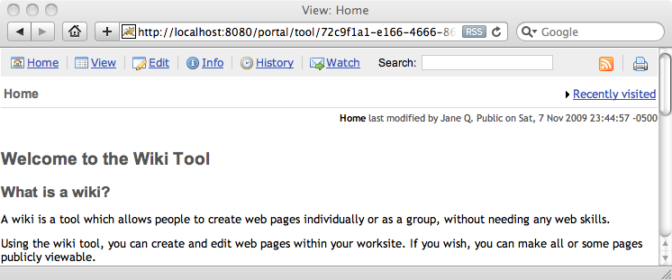
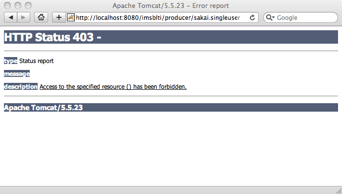
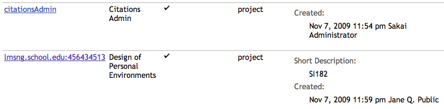
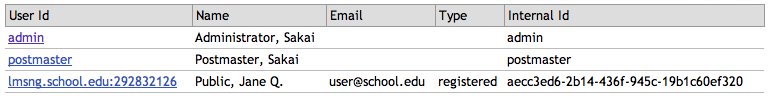

Using the Sakai LTI Tool Provider
=================================

Charles Severance

March 1, 2016

Introduction
============

This document describes Sakai's support for LTI Tool Provider. Using
this feature, Sakai can provision and export users, sites, and tools so
that those tools can be used in any portal or learning management system
that supports the LTI Consumer.

Tool Provider support in Sakai is intended to allow Sakai to act as a
multi-tenancy capable "tool appliance" providing tools to any system
which presents the proper credentials. While you can use the Sakai
instance configured to provide these tools in the normal way, the
default behaviour of the LTI Provider is to keep sites and users
separate from the sites and users created in the normal fashion using
the Sakai user interface. The sites and users which are provisioned via
LTI Provider are name-spaced using the `oauth_consumer_key` which is
shared between the tool provider and tool consumer. It is also possible
to bypass this name-spacing and allow the clean passthrough of site and
user credentials, which is useful for integrating other systems with
Sakai, where you want to share user accounts and existing sites - see
the configuration section regarding 'highly trusted consumers'.

Since the LTI Tool Provider is very powerful, it is configured off by
default. It is very important to the security of Sakai releases that
this feature is never defaulted to be on and certainly there should not
be any default provider passwords configured out of the box. In order to
allow testing, a special `sakai.properties` has been placed on the
nightly server.

Configuration
=============

In order to enable the LTI Tool Provider, you must enable it in
`sakai.properties` for your server:

    lti.provider.enabled=true

You also need to list the Sakai tool ids that you will allow to be
served out as LTI Provided tools using the following property:

    lti.provider.allowedtools=sakai.announcements:sakai.singleuser:sakai.assignment.grades:sakai.dropbox:sakai.forums:sakai.gradebook.tool:sakai.podcasts:sakai.poll:sakai.resources:sakai.schedule:sakai.samigo:sakai.rwiki

The Tool Provider will refuse to provide any tool that is not on this
list. If this item is not included, no tools will be provided.

Once you have enabled the provider and listed the allowed tools, you
need to set a key and secret for the requesting Tool Consumer. This
value should be protected as carefully as your database connection
password as knowing this secret allows an external system to create
sites and users and assume user identities if it knows this secret.

The following line adds a secret of "secret" for a key of
"lmsng.school.edu". You can have as many secrets as you like using this
pattern.

    lti.provider.lmsng.school.edu.secret=secret

Please do not use such a simple secret – a good secret should be at
least as long and random as a typical GUID.

In order to allow clean passthrough of site and user credentials, add
the key to the list of trusted consumers using the following property:

    lti.provider.highly.trusted.consumers=lmsng.school.edu:another.school.edu

If a request comes through from a consumer on this list, then the user
and site credentials will be used as-is, ie they will not be namespaced.

If the calling LMS is a Sakai server that is connected to the same database
so the LTI provider, the provider will not make a new site and take its
role from the `ext_sakai_role` on the launch request - which should be the
same as the role in the site in the calling Sakai instance.

If the calling LMS is a Sakai server that is not connected to the same
database as the calling LMS, the site will be created and if the
`ext_sakai_role` is in the created site, the user will be assigned
that role.   If the newly created site uses the realm `!site.template.lti`
the `ext_sakai_role` will not make and it will add the user to the
new site using the LTI role as the site role.

If the calling LMS is not a Sakai server, it won't send the `ext_sakai_role`
and the Sakai site role will be derived from the incoming LTI role.

You can see more details on role mapping at:

* [Sakai to LTI Role Mapping](LTIROLES.md)

Using the LTI Tool Provider
===========================

Once the tool provider is enabled, you have specified a key and secret
in the properties, you can access the tools for testing using an LTI
Consumer. In this section we will use a PHP consumer at the following address:

https://www.tsugi.org/lti-test/lms.php

If you don't want to share your secret with Tsugi, you can grab your own
copy of the PHP based LTI code at

https://github.com/tsugiproject/lti-test

Once you have the test LMS up, enter the URL of your Sakai instance as
follows:

    URL: http://localhost:8080/imsblti/provider/sakai.rwiki
    Key: lmsng.school.edu
    Password: secret

Note that the default key is "12345" – not lmsng.school.edu – so make
sure to change it and press "Submit" to you don't get "Invalid OAuth
Consumer" from the Sakai Provider when you launch.

You should see the Sakai Wiki tool. Notice the name "Jane Q. Public"
which was provisioned from the LTI PHP Tool Consumer.

The provider is enabled on nightly servers for testing with a key of "12345"
and secret of "secret" for convienent testing:

http://trunk-maria.nightly.sakaiproject.org/imsblti/provider/sakai.rwiki

You should also see log messages indicating the creation of the user,
site, and tool as follows:

    INFO http-8080-Processor25 org.sakaiproject.blti.ProviderServlet -
    Created user=lmsng.school.edu:292832126
    INFO http-8080-Processor25 org.sakaiproject.blti.ProviderServlet -
    Created site=lmsng.school.edu:456434513 label=SI182 type=project
    title=Design of Personal Environments
    INFO http-8080-Processor25 org.sakaiproject.blti.ProviderServlet - Tool
    added site=lmsng.school.edu:456434513 tool\_id=sakai.rwiki

Using this approach you can plug Sakai tools into any LMS, portal or
software that supports the LTI Consumer.

Security Checks for Release
===========================

Since it is important to protect this URL, please make the following
test of every released version of Sakai.

Once your Sakai has started up, navigate to the following URL:

http://localhost:8080/imsblti/provider/sakai.singleuser

You should see a 403 (Forbidden) message as shown below:

You should also see a warning message in the `catalina.out` file:

WARN http-8080-Processor25 org.sakaiproject.blti.ProviderServlet - LTI
Provider is Disabled IP=0:0:0:0:0:0:0:1%0

These two indicate that the LTI Tool Provider is properly disabled in
the out of the box configuration. To get past the 403 response, the
servlet must be enabled in `sakai.properties` as shown above.

Note that if you do the security test on a nightly server, you will get
an `Invalid value for LTI Launch` error because the provider is enabled
on the nightly servers for testing.

http://trunk-maria.nightly.sakaiproject.org/imsblti/provider/sakai.singleuser

Implementation Detail
=====================

You can log into your Sakai and see how the Sakai LTI Provider
implements multi-tenancy and keeps the incoming LTI users and sites from
"mixing" with the normal Sakai users and sites.

In order to limit collisions, the LTI Provider prepends the
`oauth_consumer_key` to the LTI `user_id` value to produce the
Sakai Enterprise ID (i.e. EID). Similarly, the Provider prepends the
`oauth_consumer_key` to the LTI `context_id` value to produce the
site's id as shown below in the Administrator `Sites` tool.

Similarly, if you look in the Sakai Administrator's `Users` tool, you
can see the name-spaced user accounts:

And if you look in the `Realms` tool, you can see that the name-spaced
user account has been properly joined to the name spaced site with the
correct role as requested by the LTI Consumer.

Note that if you are integrating with the Provider and are a 'highly
trusted consumer', no namespacing will occur; the user and site
credentials will be used as-is.

Regarding the siteId – unless the consumer is highly trusted, the siteId
will become a SHA-1 hash of the oauthConsumerKey and ltiContextId (i.e.
`siteId = ShaUtil.*sha1Hash*(oauth_consumer_key + ":" + context_id))`.
The original LTI contextId passed by the consumer will be stored in a
site property called `lti_context_id` for future reference and/or
matching.

Conclusion
==========

This feature makes it possible to export Sakai tools to other Learning
Management Systems using the LTI standard.

The code for the LTI Tool Provider for Sakai is relatively
straightforward and is completely contained in:

basiclti-portlet/src/java/org/sakaiproject/blti/ProviderServlet.java

The code supports the "Sakai Tool Appliance" use case out of the box.
However if organizations want to add or change business rules based on
local needs, the code is relatively straightforward and easy to modify.
Of course if you choose to modify be very mindful of security
implications as you go through the code.

The longest-term goal is to create a market for external tools and
content that can easily be plugged into any LMS system including some we
have not even yet imagined.

Acknowledgements
================

Many people contributed to the creation of the LTI 1.0
specification, including Lance Newmann of Blackboard, Greg McFall of
Pearson Education, Bruno Van Haetsdaele and Mark Ritter of Wimba,
Anthony Whyte of Sakai Foundation, and Noah Botimer and Matt Jones of
the University of Michigan, and many others.

The code for the LTI Provider is based on some earlier work by Katie
Edwards who was supported by Google to work on Sakai during the 2008
Google Summer of Code.

