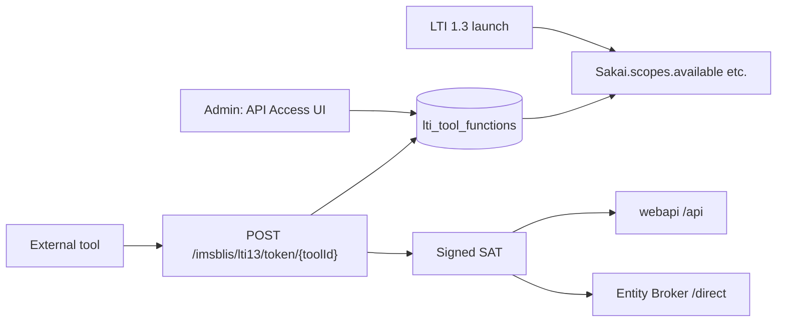

# Sakai LTI API Access

This document describes Sakai’s LTI-authorized platform API: granting tools access to Sakai
functions, issuing bearer tokens, and exposing launch-time substitution variables so tools can
discover base URLs and granted scopes.

## Overview

External LTI 1.3 tools can call Sakai APIs using a **Sakai Access Token (SAT)** obtained from the
LTI Advantage token endpoint. Which APIs a tool may use is controlled per tool in the
**API Access** admin screen (formerly “API Configuration”). Permissions are stored in the
`lti_tool_functions` table and enforced when tokens are issued.



## Admin UI: API Access

**Location:** External Tools (system tools) → tool → **API Access**

- System administrators only (`!admin` site).
- Lists all **registered Sakai security functions** from `FunctionManager.getRegisteredFunctions()`.
- Checked functions are persisted in `lti_tool_functions` (`tool_id`, `function_name`).
- Unregistered function names submitted from the UI are ignored.
- **Clear all** unchecks every function on the form; **Clear all and save** persists an empty grant set.

## OAuth scopes and functions

Tools request **OAuth scopes** at the token endpoint. Sakai maps each granted **function** to a
scope:

| Function (DB / checkbox) | OAuth scope (token request) |
|--------------------------|-----------------------------|
| `content.read` | `sakai.lti.api.content.read` |
| `gradebook.write` | `sakai.lti.api.gradebook.write` |

Mapping helpers: `SakaiAccessToken.functionToLtiApiScope()` / `ltiApiScopeToFunction()`.

Prefix: `sakai.lti.api.` (`SakaiAccessToken.SCOPE_LTI_API_PREFIX`).

## Token endpoint

**URL:** `{serverUrl}/imsblis/lti13/token/{toolId}`

Implemented in `LTI13Servlet.handleTokenPost()`; token logic in `SakaiAccessTokenServiceImpl.issueAccessToken()`.

1. Validate `client_assertion` JWT against the tool’s keyset.
2. Parse requested `scope` (space-separated).
3. For each `sakai.lti.api.*` scope, grant only if the function is in `lti_tool_functions`.
4. For IMS scopes (AGS, NRPS, etc.), use existing tool flags (`allowlineitems`, `allowroster`, …).
5. If **no scopes** are granted, return `invalid_scope`.
6. Sign a SAT whose internal `scope` claim lists granted Sakai scopes; OAuth `access_token` response
   includes IMS scope strings and the SAT as the bearer value.

Signing keys: `lti.advantage.lti13servlet.public` / `private` or generated and cached in Ignite.

## LTI 1.3 launch substitution variables

Tools can read granted scopes and API base URLs from **custom parameters** using substitution
variables (set in the tool’s **Custom Parameters** field).

| Substitution variable | Value |
|----------------------|--------|
| `Sakai.direct.url` | `{serverUrl}/direct` (Entity Broker) |
| `Sakai.api.url` | `{serverUrl}/api` (webapi WAR) |
| `Sakai.scopes.available` | Space-separated OAuth scopes for functions granted in API Access |

### Example custom parameters

```text
api_url=$Sakai.api.url
direct_url=$Sakai.direct.url
scopes=$Sakai.scopes.available
```

After launch, the tool’s JWT `custom` claim contains the resolved values (e.g.
`sakai.lti.api.content.read` in `scopes` when `content.read` is granted).

Substitution is applied in `SakaiLTIUtil.addLtiApiLaunchSubstitutions()` before
`LTI13Util.substituteCustom()`.

### Platform registration

The well-known configuration (`/imsblis/lti13/well_known`) advertises these variables under
`https://purl.imsglobal.org/spec/lti-platform-configuration` → `variables`.

## Configuration

| Property | Default | Purpose |
|----------|---------|---------|
| `sakai.lti.serverUrl` | (falls back to `serverUrl`) | Base URL for LTI services and substitutions (`Sakai.api.url` is always `{serverUrl}/api`) |
| `lti.advantage.lti13servlet.public` | — | Optional SAT signing public key (Base64) |
| `lti.advantage.lti13servlet.private` | — | Optional SAT signing private key (Base64) |

## webapi bearer authentication

The `webapi` module can authenticate requests with `Authorization: Bearer <SAT>`.
See `LtiBearerTokenInterceptor` and `LtiAuthController` (`/lti/bearer-probe` for diagnostics).

SAT validation: `SakaiAccessTokenService.validateToken()`.

## Testing

### Manual test plan

1. Open a system LTI 1.3 tool → **API Access** → grant `content.read` → Save.
2. Add custom parameters (see example above) → launch tool → verify `custom` claim values.
3. POST to `/imsblis/lti13/token/{toolId}` with `scope=sakai.lti.api.content.read` and valid
   `client_assertion` → receive token; repeat with scope not granted → `invalid_scope`.
4. **Clear all and save** → launch shows empty `scopes`; token request for that scope fails.

## Security notes

- Only **system administrators** can change API Access grants.
- Launch substitution exposes **which scopes are granted**, not secret credentials.
- Tools only receive SATs for scopes they request and that are granted; empty grant → no token.
