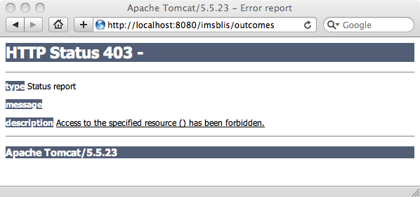
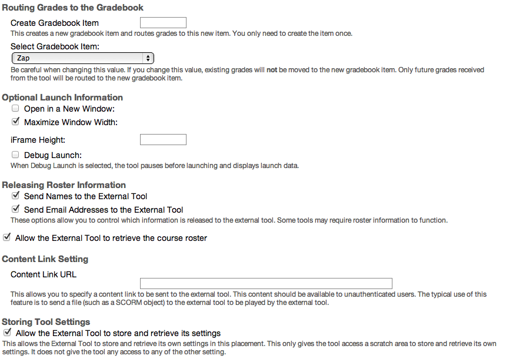
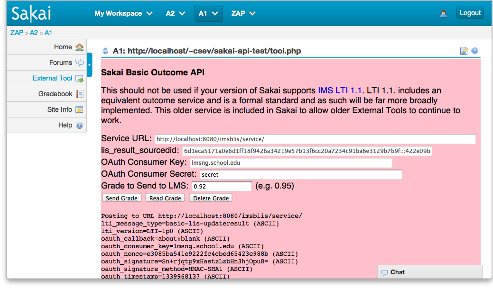

Sakai External Tool API
=======================

Charles Severance

September 2, 2015

Introduction
============

This document describes APIs available to an External Tool when launched
from Sakai using IMS LTI. Sakai provides APIs for the following
capabilities:

-   Retrieving a roster including the ability to set al the grades for
    all of the people in the roster

-   Setting a grade in the grade book (outcome) – this is deprecated and
    included for backwards compatibility since LTI 1.1 now supports
    outcomes in a standard cross-LMS manner.

Several of these extensions APIs are implemented in the same fashion in
the LTI4Moodle, ATutor 2.0.2, and the Building Block and PowerLink
from SPV Software

Testing/Sample Code
===================

Can check out testing/sample code from the following location:

    https://github.com/tsugiproject/lti-test

You can use these tests at:

    https://www.tsugi.org/lti-test/

The test code is quite simple and all of the code is in a few files and
so you can use this as sample code if your application is written in
PHP.

Configuration
=============

In order to enable the LTI Tool Provider, you must add the
following values to the **sakai.properties** for your server:

    lti.outcomes.enabled=true
    lti.roster.enabled=true

Also, the Gradebook demands to know an account that is setting each
grade. Since these grades are being set via web services, we can define
that account that is to be treated as the "grade setting" account using
the following properties:

    lti.outcomes.userid=lti
    lti.outcomes.usereid=lti

You must create the User in the administrator interface before accepting
web service requests to set outcomes. If this points to a non-existent
account, any attempt to set a grade will fail with a Null Pointer
Exception.

Security Checks for Release
===========================

Since it is so important to protect the URL for the outcomes, please
make the following test of every released version of Sakai.

Once your Sakai has started up, navigate to the following URL:

http://localhost:8080/imsblis/outcomes

The out-of-the-box distribution should not include properties to enable
outcomes so unless you have added the properties, you should see a 403
(Forbidden) message as shown below:

You should also see a warning message in the **catalina.out** file:

2010-08-04 13:12:41,656 WARN http-8080-Processor21
org.sakaiproject.lti.SimpleOutcomesServlet - LTI Outcomes are
Disabled IP=0:0:0:0:0:0:0:1%0

These two indicate that the LTI Outcomes is properly disabled in
the out of the box configuration. Out of the box, there are two ways
that the servlet is protected and two properties that need to be
changed. First, the **RemoteHostFilter** is configured to only accept
"local" IP addresses. Second, to get past the 403 response, the outcomes
servlet must be enabled in **sakai.properties** as shown above.

Configuration Within Sakai
==========================

Once you have enabled the extensions in **sakai.properties**, you must
enable them in the tool placement configuration as well:

There is a test harness for each API that allows you to exercise the
API. Each screen has a form to specify parameters, makes the calls and
dumps out request and response data to help you debug your tools and
implementations.

You can also look at the source code of the test harness to help develop
your own External Tools to call this API.

Roster API
==========

This is the most useful of the extensions - it allows the External Tool
to retrieve the entire roster of the context\_id (i.e. course). If Sakai
is willing to provide the roster it adds the following values to the
launch:

    ext_ims_lis_memberships_url=http://localhost:8080/imsblis/service/
    ext_ims_lis_memberships_id=7d65a1b397c0d4b1e86b6

To retrieve the roster, the Tool Provider sends the following POST data
(form encoded) and signed using OAuth to the
**ext\_ims\_lis\_memberships\_url**.

    POST http://localhost:8080/imsblis/service/  
    id=7d65a1b397c0d4b1e86b6
    lti_message_type=basic-lis-readmembershipsforcontext
    lti_version=LTI-1p0  
    oauth_callback=about:blank
    oauth_consumer_key=12345
    oauth_nonce=0c9a78b4fef3a8c06852af669b682ac4 oauth_signature=lyd/UAIyf/82kyw/bljrxILcGhM=
    oauth_signature_method=HMAC-SHA1
    oauth_timestamp=1338867958
    oauth_version=1.0

**id**

The **id** is the one provided on the launch
as **ext\_ims\_lis\_memberships\_id**. This value is opaque and signed
by Sakai to insure that it is not modified by the External Tool.

**Returned Data**

    <?xml version="1.0" encoding="UTF-8" standalone="no"?>
    <message_response>
       <lti_message_type>basic-lis-readmembershipsforcontext</lti_message_type>
       <members>
         <member>
           <lis_result_sourcedid>7d69999997</lis_result_sourcedid>
           <person_contact_email_primary>hir@ppp.com</person_contact_email_primary>
           <person_name_family>Sakai</person_name_family>
           <person_name_full>Hirouki Sakai</person_name_full>
           <person_name_given>Hirouki</person_name_given>
       <person_sourcedid>hirouki</person_sourcedid>
           <role>Instructor</role>
           <user_id>422e099999-45dc-a4e5-196d3f749782</user_id>
         </member>
         <member>
           <lis_result_sourcedid>7d65a1b397</lis_result_sourcedid>
           <person_contact_email_primary>csev@ppp.co</person_contact_email_primary>
           <person_name_family>Severance</person_name_family>
           <person_name_full>Charles Severance</person_name_full>
           <person_name_given>Charles</person_name_given>
       <person_sourcedid>csev</person_sourcedid>
           <role>Learner</role>
           <user_id>422e09b8-b53a-45dc-a4e5-196d3f749782</user_id>
         </member>
       </members>
       <statusinfo>
         <codemajor>Success</codemajor>
         <codeminor>fullsuccess</codeminor>
         <severity>Status</severity>
       </statusinfo>
     </message_response>

Conclusion
==========

These services allow external tools to have a more rich interaction with
Sakai.
