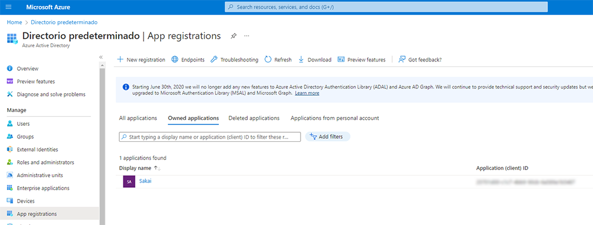
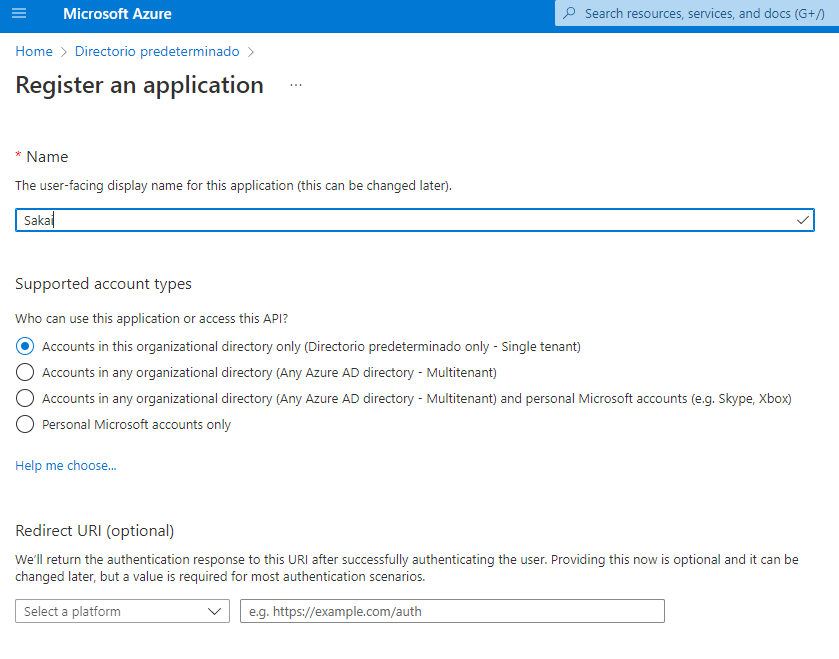
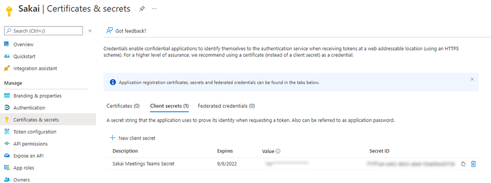
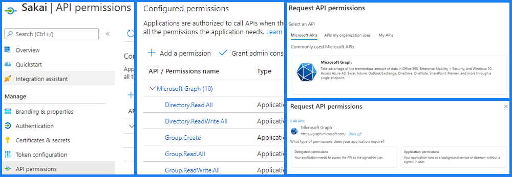

# SAKAI - Online Meetings tool

This is a tool for Sakai dedicated to the creation, management and use of virtual meeting rooms based on different online video conferencing providers. Instructors can schedule new meetings for their students on a site or group basis. Students can see a list of their scheduled meetings for each site and access them directly by clicking on them. Only members of the organization can access these meetings, unless the organizer allows guest access.

#### Features

- Instructors can schedule new meetings for their students.
- Instructors can control access to meetings by site or group.
- Students can access a list of their scheduled meetings.
- Search for scheduled meetings by name.
- Meetings can be added as events to the site calendar.
- Instructors can notify all meeting participants by e-mail.
- Only members of the organization can access Microsoft Teams meetings.
- Only the organizer can invite external users to access the Microsoft Teams meeting.
- Simple, fast and responsive interface.

## Current supported providers
- Microsoft Teams

## Prerequisites
You need:
- A Sakai 21.x instance or higher. (For Sakai 20.x instances you might want to checkout the 20.x branch if it's available, for newer versions Master is fine).
- For Microsoft Teams integration:
  - A Microsoft Azure Active Directory application.
  - Azure Active Directory users must have the same email in Sakai to be identified as members of the organization.

## Microsoft Teams
### Azure AD configuration
You must create a new application in the  _App Registrations_ section of the Azure Active Directory portal by clicking on the _New Registration_ button.



You can enter a name and select the supported account types. The _Single tenant_ option is marked by default.



To grant **Meetings tool** access to your registered Azure application, you will need a **client secret**. To obtain this, you can access the _Certificates & secrets_ section within the configuration page of your registered Azure application.



Once the app is created, you need to configure the permissions for your registered Azure App in the _API Permissions_ section. To add a new permission you must click _Add a permission_, then select _Microsoft Graph_ and _Application Permissions_.



The permissions to enable are defined in the following table:

```sh
Directory.Read.All
Directory.ReadWrite.All
Group.Create
Group.Read.All
Group.ReadWrite.All
OnlineMeetings.ReadWrite.All
Team.Create
Teamwork.Migrate.All
User.Read
User.Read.All
```

Then you must click on the _Grant admin consent_ button for your Azure directory.

### Application access directives
In order for Sakai to manage meetings on its own, without user authentication by Microsoft, you need to set up an application user and its access policies. You can read the official Microsoft documentation on these steps:

https://docs.microsoft.com/en-us/graph/cloud-communication-online-meeting-application-access-policy

## Sakai configuration
### Microsoft Teams
You have to configure your server's Sakai properties file so that the Meetings tool can access your Azure App. These are the properties you need to configure:


| PROPERTY | VALUE | DESCRIPTION | 
| ------ | ------ | ------ |
| meetings.msteams.authority | https://login.microsoftonline.com/{tenant}/ | {tenant} is the Tenant ID of your Azure Active Directory |
| meetings.msteams.clientId | {clientId} | {clientId} is the Application (Client) Id from your _App registration_  |
| meetings.msteams.secret | {secret} | This is the secret you created under _Certificates & secrets_ section  |
| meetings.msteams.scope | https://graph.microsoft.com/.default | This is a fixed value |

## Future plans and Roadmap

- Improve documentation.
- Right now is a contrib project, institutions can start evaluating and using it.
- We want feedback from institutions about the tool.
- Improve Microsoft permissions for institutions using Microsoft accounts.
- Contribution to Sakai Master may happen soon depending on discussions and feedback.
- Reuse the meeting card component in other tools like Lessons or create a meeting widget.
- Support other webconference providers like Zoom or BBB depending on funding or contributions.

## Compatibility
Version 1.0+ of Meetings is compatible with Sakai 21.x and higher, Sakai 20.x compatibility is under review because of Hibernate and Spring dependencies.

## Contact
If you have any questions please contact the devs at **Entornos de Formacion S.L.** at sakaigers@edf.global
