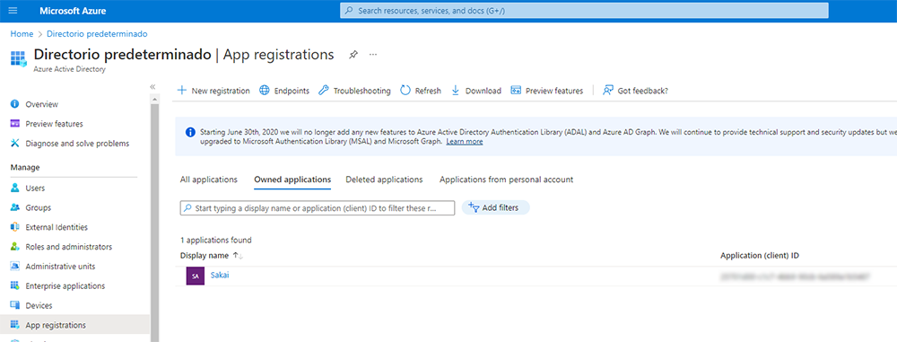
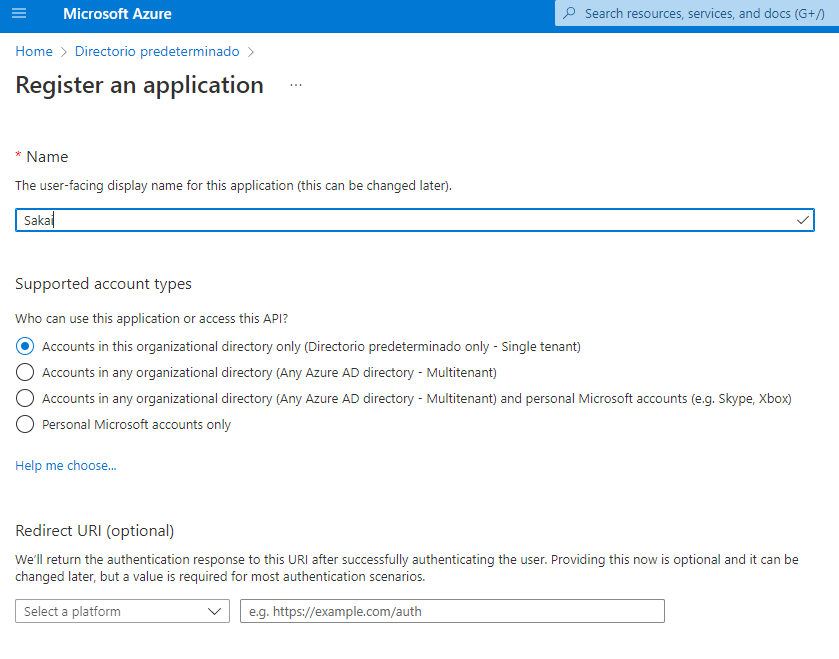
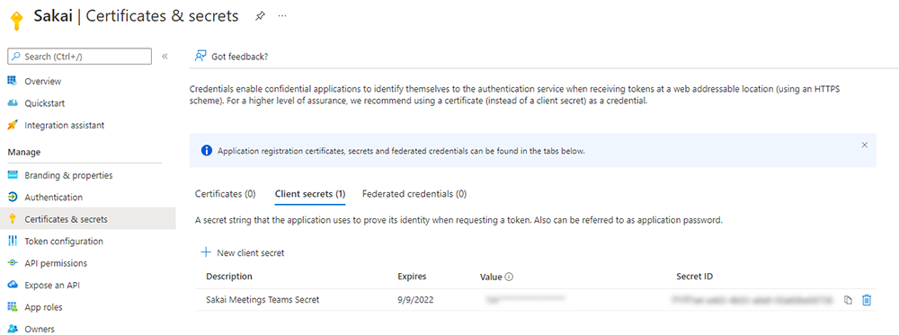
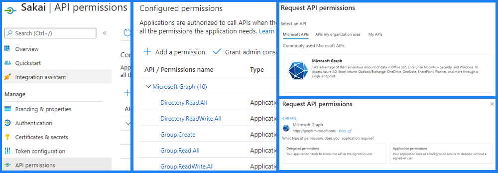

# Sakai - Microsoft Suite Integration

This project contains:
- Generic/Common API + services to communicate with Microsoft API (Microsoft Graph Library)
- Administrator Workspace Tool to manage integration between Sakai Sites/Groups and Microsoft Teams/Channels

#### Tool Features

- Admin can configure Microsoft credentials used to authenticate.
- Admin can create relationships between Sites/Groups and Teams/Channels
- Relationships can be used to synchronize users from Sakai to Microsoft.
- Relationships can be "forced" or not.
	- In a "normal" relationship, a Microsoft Team/Channel will end with all users from the Sakai Site/Group related (the Microsoft Team/Channel may have users other than Sakai ones).
	- In a "forced" relationship, a Microsoft Team/Channel will end with and only with all users from the Sakai Site/Group related.
- Users in Sakai with permission *SiteService.SECURE_UPDATE_SITE* will be added to Microsoft Team/Channel as *owner*. Otherwise they will be added as normal member.
- Auto-config process to create relationships automatically based on existing Sites and Teams. This offers an option to create new Teams/Channels if no match found.
- Job Scheduler included to synchronize all existing relationships.
- Hooks included to provide a real-time synchronization:
	- Create Team when Site is created.
	- Create Channel when Group is created.
	- Delete Team when Site is delete.
	- Delete Channel when Group is delete.
	- Add user to Team when user is added to Site.
	- Add user to Channel when user is added to Group.
	- Remove user from Team when user is removed from Site.
	- Remove user from Channel when user is removed from Group.
- All hooks can be enabled/disabled from config tab.
- Sakai-Microsoft User Mapping configurable. How can we know a user in Sakai exists or not in Microsoft? We will use a specific user field:
	- Sakai:
		- Eid
		- Email
		- User Property: microsoft_mapped_id
	- Microsoft:
		- UserId
		- Email
- During the syncrhonization process (manual, scheduled or real-time) Sakai users that do not exist in Microsoft AD, will be invited.
	- This behaviour can be enabled/disabled from config tab.
	- **Important**: Guest users will have limited permissions. For example, they never will be able to be Team/Channel owners.

## Prerequisites
You need:
- A Sakai 22.x instance.
- For Microsoft integration:
	- A Microsoft Azure Active Directory application.
	- Azure Active Directory users must exist in Sakai and share an identification field (tipically, the email).

## Microsoft Teams
### Azure AD configuration
You must create a new application in the  _App Registrations_ section of the Azure Active Directory portal by clicking on the _New Registration_ button.



You can enter a name and select the supported account types. The _Single tenant_ option is marked by default.



To grant **MicrosoftCommonService** access to your registered Azure application, you will need a **client secret**. To obtain this, you can access the _Certificates & secrets_ section within the configuration page of your registered Azure application.



Once the app is created, you need to configure the permissions for your registered Azure App in the _API Permissions_ section. To add a new permission you must click _Add a permission_, then select _Microsoft Graph_ and _Application Permissions_.



The permissions to enable are defined in the following table:

```sh
ChannelMember.Read.All
ChannelMember.ReadWrite.All
Directory.Read.All
Directory.ReadWrite.All
Group.Create
Group.Read.All
Group.ReadWrite.All
Mail.Send
Team.Create
TeamMember.Read.All
TeamMember.ReadWrite.All
User.Invite.All
User.Read
User.Read.All
```

Then you must click on the _Grant admin consent_ button for your Azure directory.

## Sakai - Microsoft Authorization Tool
Used to manage Authorization Code Flow from Microsoft: https://learn.microsoft.com/en-us/azure/active-directory/develop/v2-oauth2-auth-code-flow. This will enable the delegated access to Microsoft API.

Requires additional delegated permissions:
```sh
Files.Read.All
User.Read
```

**Important**: This tool replaces **cloud-storage/onedrive** so these deployed elements will be no longer needed:
- .../lib/sakai-onedrive-api-XX.jar
- .../components/sakai-onedrive-impl
- .../webapps/sakai-onedrive-tool
- .../webapps/sakai-onedrive-tool.war

## Sakai configuration
Everything will be configured through the administration tool.

## Future plans and Roadmap
- Include custom Sakai permission to identify Microsoft owners.
- Posibility to configure user property to use for ID mapping.
- New Hook when user changes role in a Sakai Site.
- Improve UI (accesibility, style cleaning).
- Process hook: allUsersRemovedFromGroup

## Contact
If you have any questions please contact the devs at **Entornos de Formacion S.L.** at sakaigers@edf.global
